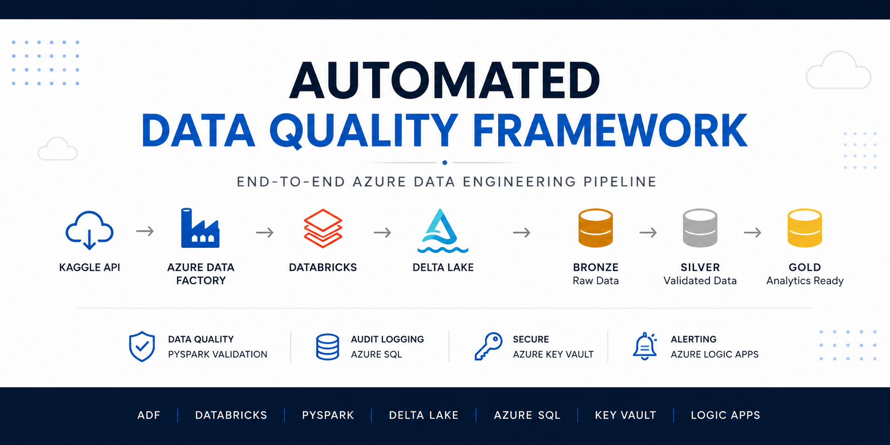
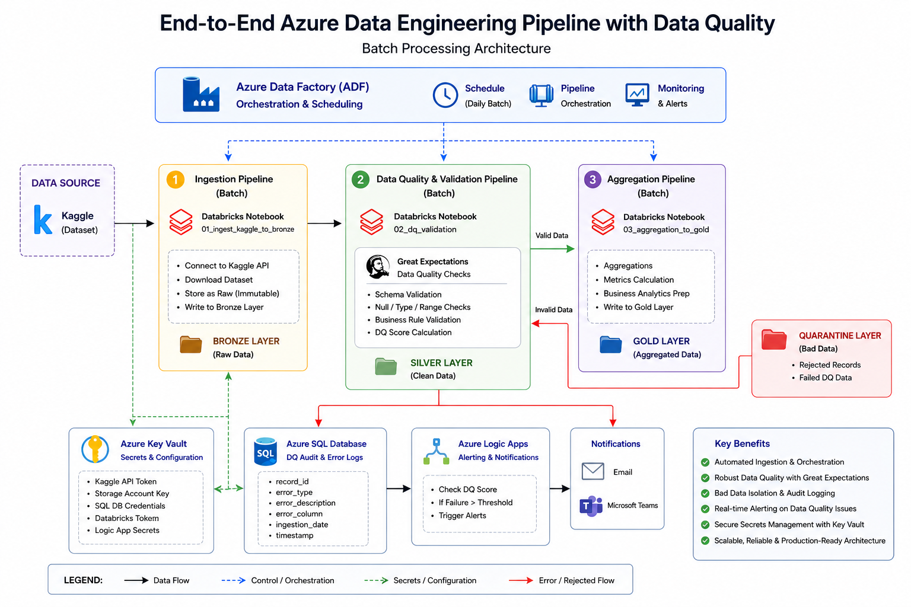
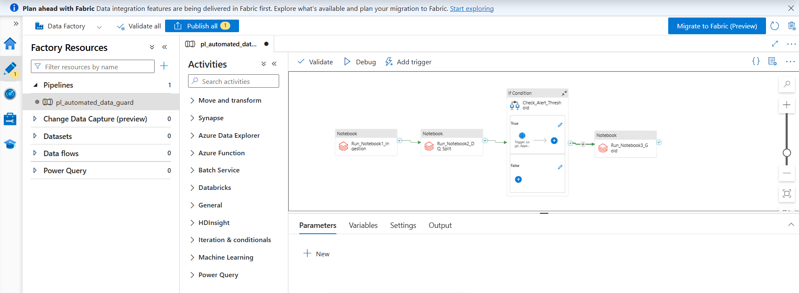
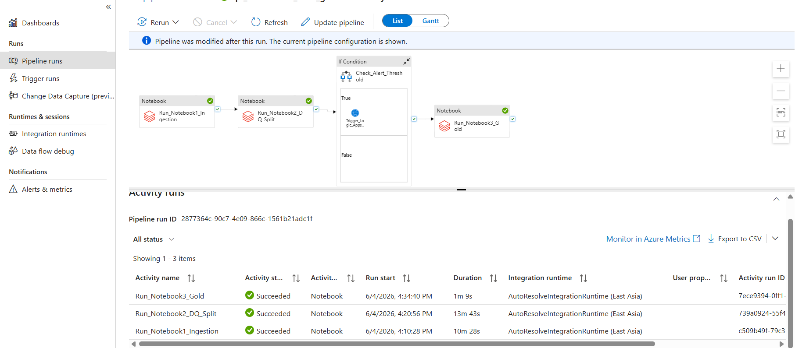
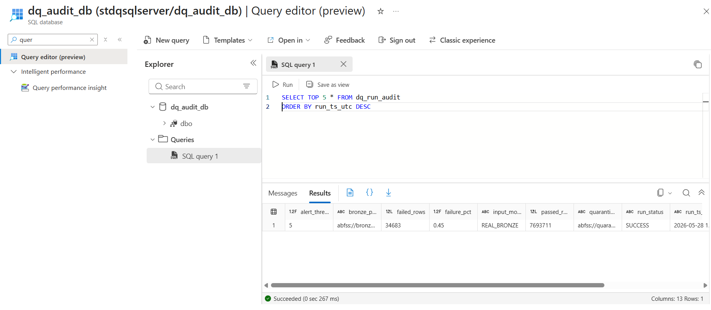

<p align="center">
  
</p>

<h1 align="center">Automated Data Guard</h1>

<p align="center">
End-to-End Azure Batch Data Quality Pipeline with PySpark Validation, Delta Lake, Audit Logging & Automated Monitoring
</p>

<p align="center">


</p>

---

## Overview

Automated Data Guard is a production-style Azure Data Engineering project that implements an end-to-end batch data quality validation and monitoring pipeline.

The pipeline processes **7.7M+ US Accident records (2.85 GB)** from Kaggle using a modern **Bronze → Silver → Gold Lakehouse Architecture**.

The system automates:

- Batch data ingestion
- Data quality validation
- Invalid data quarantine
- Audit logging
- Gold analytics generation
- Failure monitoring and alerting

---

## Architecture

<p align="center">

</p>

### Pipeline Flow

```
Kaggle API
     |
     v
Azure Data Factory
     |
     v
Azure Databricks
     |
     v
Bronze Layer
     |
     v
PySpark Data Quality Engine
     |
     |
 PASS          FAIL
  |              |
  v              v
Silver       Quarantine
  |
  v
Gold Analytics
```

---

## Tech Stack

| Component | Technology |
|---|---|
| Orchestration | Azure Data Factory |
| Processing | Azure Databricks |
| Language | PySpark |
| Storage | ADLS Gen2 |
| Architecture | Bronze-Silver-Gold Lakehouse |
| Format | Delta Lake |
| Database | Azure SQL Database |
| Security | Azure Key Vault |
| Alerting | Azure Logic Apps |
| Dataset | Kaggle US Accidents |

---

## Pipeline Results

| Metric | Value |
|---|---|
| Dataset Size | 2.85 GB |
| Total Records Processed | 7,728,394 |
| Silver Records | 7,693,711 |
| Quarantine Records | 34,683 |
| Pass Rate | 99.55% |
| Data Quality Rules | 19 |
| Gold Tables | 5 |
| Runtime | ~25 minutes |

---

# Pipeline Implementation

## 1. Bronze Ingestion Layer

Notebook:

`01_bronze_ingestion.ipynb`

Responsibilities:

- Connects to Kaggle API
- Downloads accident dataset
- Retrieves secrets securely from Azure Key Vault
- Stores raw data in ADLS Bronze layer

---

## 2. Data Quality Validation Layer

Notebook:

`02_data_quality_validation.ipynb`

The validation engine applies **19 PySpark data quality rules**.

Validation categories:

| Category | Checks |
|---|---|
| Identity | ID validation, Duplicate detection |
| Event | Severity range, Start time checks |
| Location | Latitude, Longitude, State, Country validation |
| Weather | Temperature, Humidity, Pressure, Visibility |
| Temporal | Timestamp consistency |

Processing:

```
Bronze Data
     |
Schema Standardization
     |
DQ Rule Engine
     |
Silver / Quarantine Split
```

Results:

- 7,693,711 records → Silver
- 34,683 records → Quarantine

---

## 3. Gold Analytics Layer

Notebook:

`03_gold_aggregations.ipynb`

Creates business-ready aggregation tables.

| Gold Table | Purpose |
|---|---|
| Accidents by State | Location analysis |
| Accidents by Severity | Severity distribution |
| Accidents by Hour | Time analysis |
| Accidents by Weather | Weather impact |
| Daily Trend | Historical trends |

---

# Performance Optimizations

## Single-Pass Schema Standardization

Optimized:

- Column normalization
- Data type casting
- Schema consistency

---

## Optimized Duplicate Detection

Implemented Spark distributed duplicate detection using:

```
groupBy() + join()
```

for scalable processing on millions of records.

---

## Null-Safe Validation

Implemented:

```
F.coalesce(rule_expression, F.lit(False))
```

Validation behavior:

```
TRUE  -> PASS

FALSE / NULL -> FAIL
```

This prevents unclear validation states.

Achieved approximately:

**9.4K records/sec validation throughput**

---

# Security

Implemented secure credential management using:

- Azure Key Vault
- Databricks Secret Scope

Protected:

- Kaggle API Token
- Storage Account Key
- Azure SQL Credentials

No hardcoded credentials are stored inside notebooks.

---

# Azure SQL Audit Logging

Every execution stores pipeline metadata:

- Run timestamp
- Total records
- Passed records
- Failed records
- Failure percentage
- Pipeline status

Flow:

```
Databricks
     |
     v
JDBC
     |
     v
Azure SQL Audit Table
```

---

# Automated Alerting

Azure Logic Apps monitors data quality failures.

Flow:

```
DQ Metrics
     |
Threshold Check
     |
Alert Trigger
     |
Email Notification
```

---

# Screenshots

## Azure Data Factory Pipeline



---

## Successful Pipeline Execution



---

## Azure SQL Audit Logging



---

# Repository Structure

```
automated-data-guard

├── assets
│   ├── banner.png
│   ├── architecture.png
│   ├── adf_pipeline.png
│   ├── adf_pipeline_success.png
│   └── azure_sql_audit.png

├── notebooks
│   ├── 01_bronze_ingestion.ipynb
│   ├── 02_data_quality_validation.ipynb
│   └── 03_gold_aggregations.ipynb

└── README.md
```

---

# Skills Demonstrated

- Azure Data Engineering
- ETL Pipeline Development
- PySpark Processing
- Data Quality Engineering
- Delta Lake Architecture
- Cloud Security
- Pipeline Monitoring

---

# Author

**Mounika**

Aspiring Azure Data Engineer